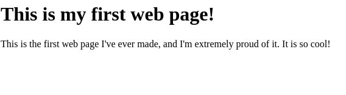
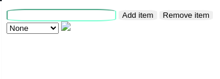

# Website 4

This Repository contains the basic HTML code that demonstrate the basic understading of components of HTML like:
- HTML Syntax

- Forms

- List

This repository also contains the flip card code, in which the card is fliped when hover over

